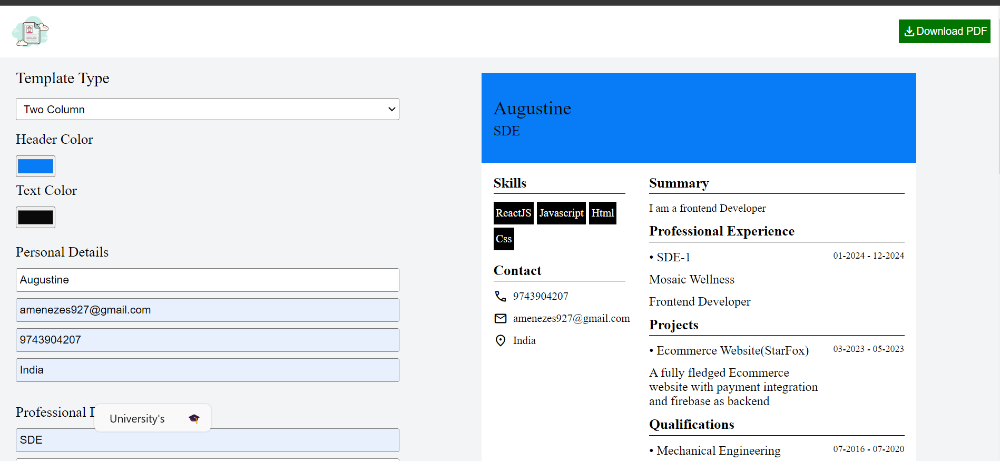

# Resume Template Maker

Welcome to the Resume Template Maker repository! This project allows users to create professional resumes using predefined templates and download them as PDF files.

## Features

- Choose from two professionally designed resume templates.
- Customize your resume with your personal and professional information.
- Download your resume as a PDF file for easy sharing and printing.

## How to Use

- [Resume Template](https://rachitgarg56.github.io/Geekathon-Team/Augustine_Menezes-Resume_Template/index.html)

## Templates

### Template 1: Two Column

This template features a two column layout with sections for personal information, work experience, education, and skills.

### Template 2: Minimalist

The modern template offers a sleek and contemporary design, ideal for showcasing your skills and accomplishments.

## Dependencies

- [html2pdf](https://github.com/eKoopmans/html2pdf.js): Used to convert HTML content to PDF files.

## Contributing

Contributions are welcome! If you have ideas for new features, bug fixes, or improvements, please feel free to open an issue or submit a pull request.

Thank you for using the Resume Template Maker! If you have any questions or feedback, please don't hesitate to reach out.
